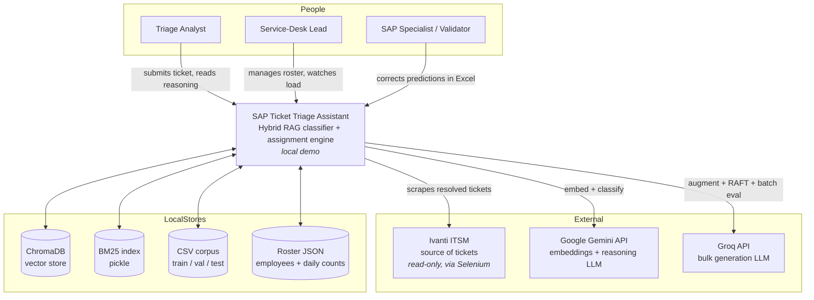
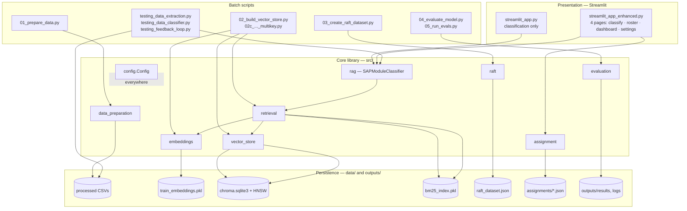
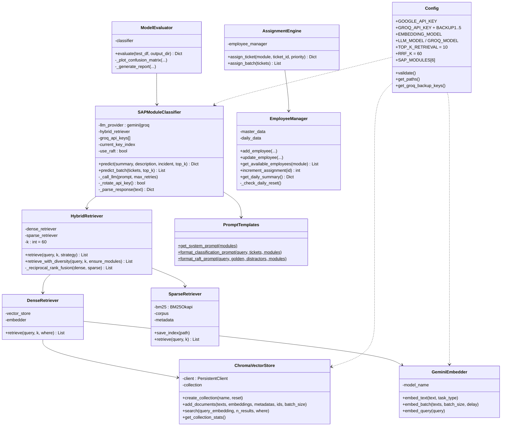
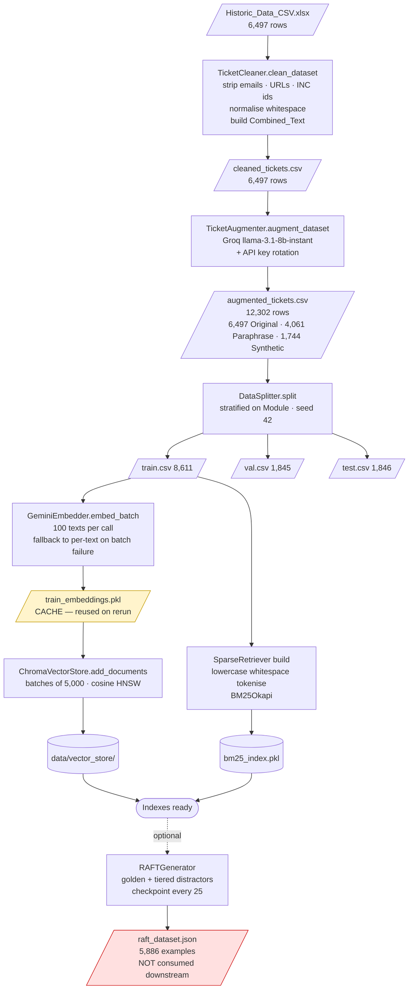
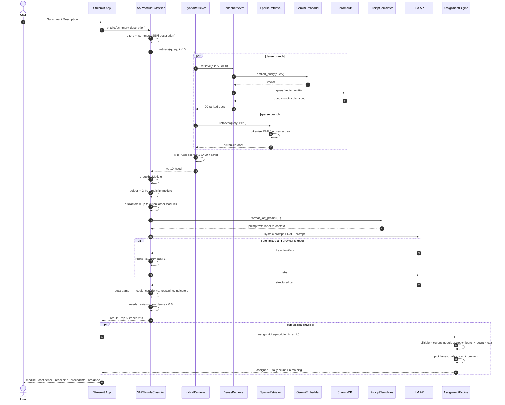
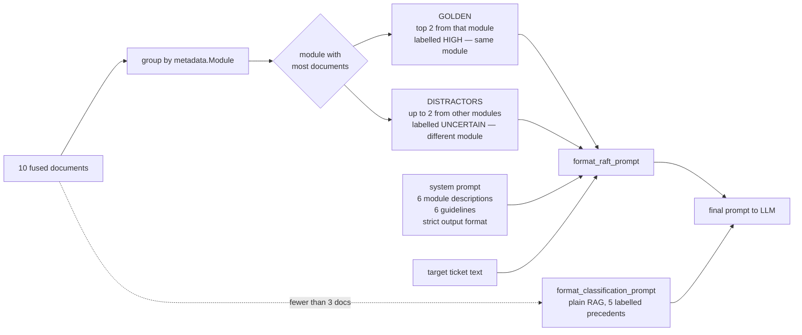
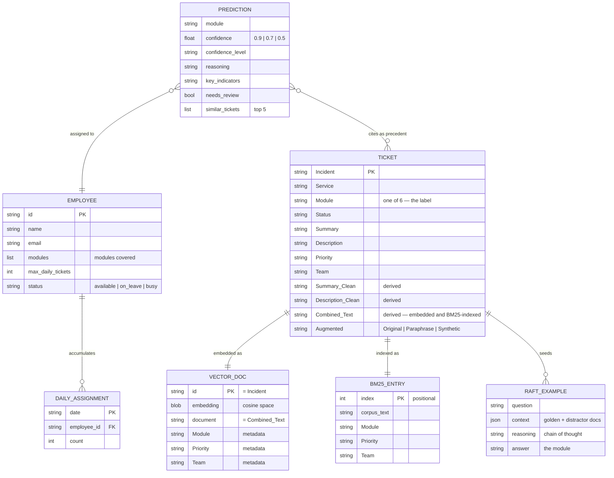
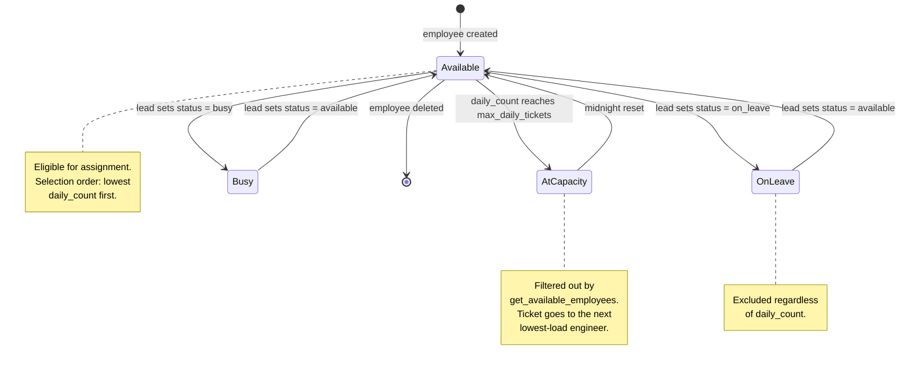
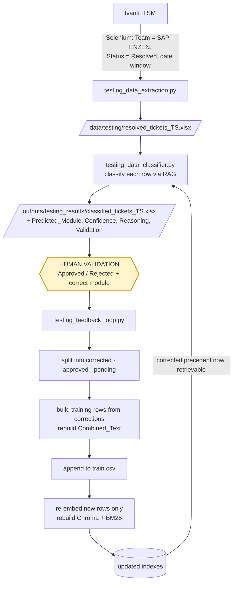

# SAP Ticket Triage Assistant — Architecture & Scenarios

**Document 3 of 5 — Architecture, design flow, component connections, runtime scenarios**
**Audience:** Architects, developers, reviewers

Diagrams are written in Mermaid and render natively in GitHub, GitLab, VS Code (with a Mermaid
extension) and most modern Markdown viewers. Where a diagram would lose information as a
picture, an ASCII figure is used instead.

---

## Table of Contents

1. [System context](#1-system-context)
2. [Container view](#2-container-view)
3. [Component view](#3-component-view)
4. [Build-time design flow](#4-build-time-design-flow)
5. [Serve-time design flow](#5-serve-time-design-flow)
6. [Retrieval subsystem in detail](#6-retrieval-subsystem-in-detail)
7. [Prompt assembly in detail](#7-prompt-assembly-in-detail)
8. [Data model](#8-data-model)
9. [Assignment state machine](#9-assignment-state-machine)
10. [Feedback loop architecture](#10-feedback-loop-architecture)
11. [Runtime topology](#11-runtime-topology)
12. [Connection matrix](#12-connection-matrix)
13. [Scenarios](#13-scenarios)
14. [Failure modes and degradation](#14-failure-modes-and-degradation)
15. [Architectural decisions and trade-offs](#15-architectural-decisions-and-trade-offs)

---

## 1. System context

Who and what the system talks to.



**Key boundary property:** the arrow to Ivanti is one-way. The system reads tickets and never
writes back — every output is a recommendation surfaced to a human.

---

## 2. Container view

The runnable units and the stores they share.



Note the shape: **the UI is thin**. Both apps are presentation over the same core library, and
every batch script reaches into the same modules. There is no service layer and no API tier —
deliberate for a demo, and the reason the two apps drifted apart once (see
`02_TECHNICAL_IMPLEMENTATION.md` §15, problem 7).

---

## 3. Component view

Class-level structure and what each component holds.



**Dependency direction is strictly downward.** `SAPModuleClassifier` knows about a retriever
interface, not about ChromaDB or BM25. Swapping the vector store means touching one class.

---

## 4. Build-time design flow

The offline pipeline, with the intermediate artifact at each hop.



Two things to notice in this diagram:

- **`train_embeddings.pkl` is highlighted** because it is a cache that can silently go stale. If
  `train.csv` changes and the pickle is not deleted, the store is rebuilt from vectors that no
  longer describe the corpus.
- **`raft_dataset.json` is highlighted** because it is a terminal node. Nothing reads it.

---

## 5. Serve-time design flow

One ticket, end to end.



---

## 6. Retrieval subsystem in detail

The most important subsystem, drawn at the level where its behaviour is decided.

```
 query = "Summary: ... [SEP] Description: ..."
        │
        ├──────────────── DENSE PATH ─────────────────┐
        │  embed_query(task_type="retrieval_query")   │
        │        ▼                                     │
        │  Chroma HNSW cosine search, n = 2k           │
        │        ▼                                     │
        │  [ (incident_id, text, meta, distance) ] × 2k│
        │  similarity = 1 - distance                   │
        │  rank = 1..2k                                │
        └──────────────────────────────────────────────┘
        │
        ├──────────────── SPARSE PATH ────────────────┐
        │  tokens = query.lower().split()              │
        │        ▼                                     │
        │  BM25Okapi.get_scores(tokens) over 8,611     │
        │        ▼                                     │
        │  argsort → top 2k                            │
        │  [ (doc_id, text, meta, bm25_score) ] × 2k   │
        │  rank = 1..2k                                │
        └──────────────────────────────────────────────┘
        │
        ▼   RECIPROCAL RANK FUSION   (k_rrf = 60)
   for each doc d:  rrf(d) = Σ_over_retrievers  1 / (60 + rank_r(d))
   sort desc by rrf, assign hybrid_rank, return top k
```

**Why the constant 60 matters.** With `k_rrf = 60`, rank 1 contributes `1/61 = 0.0164` and rank
10 contributes `1/70 = 0.0143` — a difference of only 15%. The fusion therefore treats "appeared
reasonably high in this retriever" as almost as good as "appeared first", which is exactly what
you want when neither retriever is authoritative. A small `k_rrf` would let whichever retriever
ranked a document first dominate the merge.

**Strategies exposed by `HybridRetriever.retrieve(strategy=...)`:**

| Strategy | Path | Use |
|---|---|---|
| `rrf` (default) | both, fused | Production classification |
| `dense_only` | semantic only | Ablation; measuring the value of BM25 |
| `sparse_only` | BM25 only | Ablation; **runs with no API calls**, so it is the cheap eval path |

**Live defect in this subsystem.** Dense results are keyed by real incident id; sparse results
are keyed by a synthetic `doc_<index>` because the BM25 metadata never received an `id` field at
build time. RRF keys on that id, so a document found by *both* retrievers is treated as two
distinct documents and never receives the summed score. The result is a rank-interleaved union
rather than true fusion. Diagnosis and one-line fix in `02_TECHNICAL_IMPLEMENTATION.md` §16,
issue 1.

---

## 7. Prompt assembly in detail

How retrieved documents become a prompt.



The honest caveat, stated in the design: **"golden" at inference means "the retrieval
consensus", not "the truth"** — the true label is unknown at prediction time. If retrieval is
wrong, the golden set is wrong. That is precisely why the prompt tells the model that context
may mislead and requires justification from the ticket's own content. The RAFT framing is a
defence against confidently-wrong retrieval, not an assumption that retrieval is right.

---

## 8. Data model



Note the `BM25_ENTRY` key: it is **positional**, not the incident number. That positional
identity is the root of the RRF fusion defect — the two stores describe the same tickets under
two different identity schemes.

---

## 9. Assignment state machine

Per-employee status and the daily counter lifecycle.



Daily reset is **lazy, not scheduled**: `_check_daily_reset()` compares the stored date against
today every time the manager loads its data. There is no cron and no background thread — if the
app is not running at midnight, the reset simply happens on the next load. That is the right
call for a demo, and it is worth knowing it is not a timer.

---

## 10. Feedback loop architecture



**This is a retrieval-time learning loop, not a training loop.** No gradients, no fine-tuning
run. Adding a corrected ticket to the corpus changes behaviour on the very next query, and the
change is auditable — you can point at the exact row that caused it. The cost is that the
corpus grows monotonically and nothing prunes contradictory or obsolete precedent.

---

## 11. Runtime topology

There is no deployment. This is what runs, where, during a demo.

```
┌──────────────────────── Developer workstation (Windows) ─────────────────────────┐
│                                                                                   │
│   Python venv                                                                     │
│   ┌──────────────────────────────────────────────────────────────────────┐        │
│   │  streamlit run app/streamlit_app_enhanced.py                          │        │
│   │        │                                                              │        │
│   │        ├── @st.cache_resource  ── one shared instance per process:     │        │
│   │        │     GeminiEmbedder · ChromaVectorStore · SparseRetriever      │        │
│   │        │     DenseRetriever · HybridRetriever · SAPModuleClassifier    │        │
│   │        │     EmployeeManager · AssignmentEngine                        │        │
│   │        │                                                              │        │
│   │        └── http://localhost:8501  ◄── browser                          │        │
│   └──────────────────────────────────────────────────────────────────────┘        │
│                                                                                   │
│   Local filesystem                                                                │
│   ├── data/vector_store/chroma.sqlite3 + HNSW segment dirs                        │
│   ├── data/embeddings/{train_embeddings,bm25_index}.pkl                           │
│   ├── data/processed/train_test_split/*.csv                                       │
│   ├── data/assignments/*.json                                                     │
│   └── outputs/{logs,results,testing_results}/                                     │
│                                                                                   │
│   .env  ── GOOGLE_API_KEY · GROQ_API_KEY + BACKUP1..5 · model + retrieval settings │
└───────────────────────────────────────────────────────────────────────────────────┘
              │ HTTPS, outbound only
              ▼
   ┌──────────────────────┐        ┌──────────────────────┐
   │  Gemini API          │        │  Groq API            │
   │  embeddings + Flash  │        │  llama-3.1-8b-instant│
   └──────────────────────┘        └──────────────────────┘
```

Single process, single user, no network service exposed beyond localhost. The only outbound
traffic is to the two LLM providers — and it carries ticket text, which is the one privacy
consideration that survives the "it's only a demo" framing.

---

## 12. Connection matrix

Every inter-component connection, its mechanism and its failure behaviour.

| From | To | Mechanism | Payload | If it fails |
|---|---|---|---|---|
| Streamlit app | `SAPModuleClassifier` | In-process call | summary, description | Exception surfaces in UI |
| `SAPModuleClassifier` | `HybridRetriever` | In-process call | query text, k | Empty result → plain-RAG fallback path |
| `HybridRetriever` | `DenseRetriever` | In-process call | query, 2k | Propagates; no sparse-only fallback today |
| `DenseRetriever` | `GeminiEmbedder` | In-process call | query text | API error propagates |
| `GeminiEmbedder` | Gemini API | HTTPS | text batch | Batch → per-text fallback → zero vector |
| `DenseRetriever` | ChromaDB | Local client | query vector, n | File/permission errors propagate |
| `HybridRetriever` | `SparseRetriever` | In-process call | query, 2k | Raises if index not loaded |
| `SparseRetriever` | `bm25_index.pkl` | Pickle load at init | full index | `ValueError: BM25 index not initialized` |
| `SAPModuleClassifier` | Gemini API | HTTPS | prompt | Logged, returns `None` → `Unknown` result |
| `SAPModuleClassifier` | Groq API | HTTPS | prompt | Rate limit → key rotation → 60 s wait → reset → 5 attempts |
| Streamlit app | `AssignmentEngine` | In-process call | module, ticket id | Returns explicit `unassigned` + reason |
| `AssignmentEngine` | `EmployeeManager` | In-process call | module filter | Empty roster → `None` → unassigned |
| `EmployeeManager` | `assignments/*.json` | File read/write | roster, counters | Missing file → initialised empty |
| Feedback loop | `train.csv` | Append write | corrected rows | Aborts before rebuild |
| Feedback loop | indexes | Full rebuild | corpus | Backup pickles retained |
| Extraction script | Ivanti | Selenium/Chrome | scraped DOM | Logged; no partial write |
| All modules | `Config` | Import-time singleton | env values | `validate()` raises on missing Gemini key |

---

## 13. Scenarios

Every meaningful path through the system, including the unhappy ones.

---

### S1 — Happy path: confident single classification

**Trigger:** analyst pastes *"Cannot login to SAP Portal — user gets an error at the top of the browser page"*.

```
retrieve → 10 docs, 7 Basis / 2 Connections / 1 ABAP
golden      = 2 Basis docs (majority)
distractors = 1 Connections + 1 ABAP
LLM         → Module: Basis · Confidence: High
parse       → confidence 0.9 · needs_review false
assign      → module Basis, eligible {A: 3/20, B: 7/20} → A, now 4/20
```

**Output:** Basis, High, reasoning citing portal authentication, 5 precedents shown, assigned to
A with 16 remaining. This is the design working exactly as intended: retrieval agrees, the model
agrees with retrieval for a stated reason, confidence is high, assignment lands.

---

### S2 — Ambiguous ticket, low confidence, escalated to a human

**Trigger:** *"Interface to the payroll provider is failing — invoices not posting"* — genuinely
touches Connections, HR & Payroll and FICO.

```
retrieve → 4 Connections / 3 FICO / 3 HR & Payroll   (no clear majority)
golden      = 2 Connections (thin majority)
distractors = 1 FICO + 1 HR & Payroll
LLM         → Module: Connections · Confidence: Low
parse       → confidence 0.5 · needs_review TRUE
```

**Output:** flagged for review, reasoning explains the ambiguity, all three candidate modules
visible in the precedent list. **The system does not hide the ambiguity** — this is the intended
behaviour for hard tickets, and it is why the confidence signal exists.

---

### S3 — Retrieval consensus is wrong and RAFT framing saves it

**Trigger:** an ABAP short-dump reported by a user in Basis vocabulary.

```
retrieve → 6 Basis / 3 ABAP / 1 FICO
golden      = 2 Basis   ← the retrieval consensus is WRONG
distractors = 1 ABAP + 1 FICO
prompt      → "some context may be misleading; justify from the ticket's content"
LLM         → reads "ABEND in ZFI_POST", recognises a Z-program dump
            → Module: ABAP · Confidence: Medium
            → reasoning explicitly notes the Basis context did not match the symptom
```

**Why this matters:** a plain-RAG prompt that says *"here are similar tickets"* invites the model
to follow the majority and answer Basis. The RAFT framing is what makes disagreeing with
retrieval a legitimate move. This scenario is the entire justification for pillar 2.

---

### S4 — The Connections/FICO/ABAP confusion (known failure)

**Trigger:** *"Nightly file transfer to the banking system did not run; no payment file
generated"* — truly Connections.

```
retrieve → 5 FICO ("payment file", "banking") / 3 Connections / 2 ABAP
golden      = 2 FICO   ← wrong, and the ticket's own vocabulary supports it
LLM         → Module: FICO · Confidence: Medium
```

**Outcome: wrong.** This is exactly the measured weakness — Connections recall 0.60, with 3 of
20 going to FICO and 4 to ABAP. The failure is legitimate rather than sloppy: a ticket about an
interface *to* the banking system genuinely contains financial vocabulary. Mitigations, in
order of expected value: (a) fix the RRF id defect so consensus documents are promoted properly,
(b) add Connections precedents through the feedback loop, (c) add explicit boundary rules to the
system prompt — *"if the ticket is about data moving between systems, prefer Connections even
when the payload is financial"*.

---

### S5 — Batch classification of an uploaded file

```
upload CSV/XLSX → for each row → predict() sequentially
                → append Predicted_Module, Confidence, Reasoning
                → summary counts by module, count flagged needs_review
                → download enriched file
```

Sequential by design: parallel requests against a free-tier key trip the limiter faster than the
rotation logic can absorb. 100 tickets takes a few minutes.

---

### S6 — Rate limit during a bulk job

```
request → RateLimitError on key #1
        → rotate to key #2, sleep 2 s, retry            ✔ continues
        → ... eventually all 6 keys exhausted
        → sleep 60 s, reset to key #1, retry            ✔ continues
        → 5 attempts exhausted → log error, return None
        → caller records Unknown / confidence 0 for that row and moves on
```

The job never dies on a rate limit. The worst case is a small number of `Unknown` rows in an
otherwise complete run — which is the correct trade for an unattended multi-hour job.

---

### S7 — No engineer available

```
classify → Procurement
roster   → P1 on_leave, P2 at 20/20 cap
result   → { assigned_to: null, status: "unassigned",
             reason: "No available employees" }
```

The UI shows the classification *and* an explicit unassigned banner. **The cap is never
exceeded and the ticket is never silently dropped** — the lead sees a capacity problem, which is
the actual information they need.

---

### S8 — Midnight rollover

```
23:58  E1 at 19/20, E2 at 20/20 (at capacity)
00:01  next load → _check_daily_reset() sees a new date
       → daily_assignments.json reset to {}
       → E1 0/20, E2 0/20, both eligible again
```

Lazy, not scheduled. If nothing loads the manager at midnight, the reset happens on the next
load — same outcome, later.

---

### S9 — Feedback correction changes behaviour

```
Day 1  ticket T → predicted FICO (wrong; truly Connections), Medium
       validator marks Rejected, correct module = Connections
Day 2  feedback loop appends T (labelled Connections) to train.csv
       new row embedded, Chroma + BM25 rebuilt
Day 3  near-identical ticket T' arrives
       retrieval now surfaces T as a Connections precedent
       → predicted Connections ✔
```

Correction to effect in one cycle, with no training run. The traceability is the point: the
behaviour change has a single identifiable cause you can point at.

---

### S10 — Cold start on a fresh machine

```
streamlit run → initialize_system()
  Config.validate()            → raises if GOOGLE_API_KEY missing
  GeminiEmbedder               → configures SDK, no network call
  ChromaVectorStore            → opens data/vector_store/, get_or_create collection
  SparseRetriever(index_path)  → unpickles bm25_index.pkl (the slow step, seconds)
  Dense + Hybrid retrievers    → wire-up only
  SAPModuleClassifier          → provider forced to gemini
  EmployeeManager              → loads or initialises roster JSON, checks daily reset
  → cached by @st.cache_resource for the process lifetime
```

If the indexes are missing the app raises at startup rather than serving empty results —
a fail-fast that is correct here.

---

### S11 — Corpus rebuild after the training data changes

```
train.csv modified (feedback rows appended)
   ├─ if train_embeddings.pkl deleted → full re-embed (minutes, API cost)
   └─ if NOT deleted                  → STALE: old vectors indexed against new corpus
                                        ⚠ silent, no error, wrong retrieval
rebuild → create_collection(reset=True) → add_documents(batch 5000)
        → SparseRetriever rebuild → save_index()
```

The stale-cache branch is a real trap. It produces no error and no obvious symptom — retrieval
just quietly gets worse. The feedback-loop script handles it correctly; a manual edit to
`train.csv` does not.

---

### S12 — LLM returns unparseable output

```
LLM response lacks a "Module:" line
_parse_response → module = "Unknown", confidence_level = "Medium" → 0.7
                → raw_response preserved in the result
result → module Unknown
```

**Known rough edge:** an unparseable response gets the default confidence 0.7, which is *above*
the 0.6 review threshold — so it is **not** flagged `needs_review` even though the system has no
idea what the answer is. A parse failure should force confidence to 0. Small fix, real
correctness issue.

---

### S13 — Sparse-only or dense-only operation (ablation / degraded mode)

```
hybrid.retrieve(query, k, strategy="sparse_only")  → BM25 only, ZERO API calls
hybrid.retrieve(query, k, strategy="dense_only")   → embeddings only
```

Two uses: measuring how much each retriever contributes (the eval suite runs all three), and
degraded operation — if the embedding API is unavailable, sparse-only retrieval still returns
usable precedents.

---

### S14 — Evaluation run

```
load test.csv → sample N → for each: predict() → collect y_true / y_pred / confidence
             → accuracy, per-class P/R/F1, macro + weighted, confusion matrix
             → ECE over 10 confidence bins
             → slice by Augmented tag: Original vs Paraphrase vs Synthetic
             → write evaluation_results.json, confusion_matrix.png, per_class_f1.png, report
```

The Original-only slice is the honest headline — see `05_EVALUATION.md` §4.

---

## 14. Failure modes and degradation

| Failure | Detection | Behaviour today | Degradation |
|---|---|---|---|
| Gemini embedding batch fails | Exception in `embed_batch` | Falls back to per-text, then zero vector | Graceful; a zero vector retrieves noise for that one document |
| Gemini classification fails | `None` from `_call_gemini` | Returns `Unknown`, confidence 0 | Graceful |
| Groq rate limit | `RateLimitError` | Rotate → wait 60 s → reset → 5 attempts | Graceful; slower |
| All keys exhausted | 5 failed attempts | `Unknown` for that row, job continues | Graceful |
| BM25 index missing | `ValueError` at init | App fails to start | **Fail-fast** — correct |
| Chroma directory missing | Chroma creates an empty collection | Retrieval returns nothing | **Silent** — should assert `count() > 0` |
| Stale embedding cache | none | Wrong vectors indexed | **Silent — worst case** (S11) |
| Unparseable LLM output | regex miss | `Unknown` at confidence 0.7, not flagged | **Bug** (S12) |
| No eligible engineer | empty candidate list | Explicit `unassigned` + reason | Correct |
| Roster JSON corrupted | JSON decode error | Uncaught | Should fall back to empty roster + warn |

Two entries deserve attention because they fail *silently*: the stale embedding cache and an
empty Chroma collection. Both produce plausible-looking output from a broken index.

---

## 15. Architectural decisions and trade-offs

| # | Decision | Alternative rejected | Rationale | Cost accepted |
|---|---|---|---|---|
| 1 | RAG over fine-tuning | Fine-tune a classifier | 262 examples in the smallest class is too few; adding knowledge means adding a row, not retraining | Per-query API cost and latency |
| 2 | Hybrid dense + sparse | Dense only | Dense blurs exact identifiers (`SM37`, `ZFI_*`) that matter in SAP tickets | Two indexes to build and keep in sync |
| 3 | RRF fusion | Weighted score blending | Cosine and BM25 scales are not comparable; rank fusion needs no calibration | Loses score magnitude information |
| 4 | RAFT-style prompting | Plain RAG prompting | Counteracts majority-class parroting from an imbalanced corpus | Longer prompts, more tokens |
| 5 | Two LLM providers | One provider | Free-tier limits make one provider unable to serve both quality and bulk | Two SDKs, two failure modes |
| 6 | API key rotation | Backoff only | Multi-hour unattended jobs must survive rate limits | Key management burden |
| 7 | Augment before split | Split then augment | Simpler pipeline at the time | **Wrong call** — causes near-duplicate leakage (§16.3 of doc 2) |
| 8 | ChromaDB local | Hosted vector DB | Zero infrastructure for a demo | Not multi-user or scalable |
| 9 | JSON roster | SQLite/Postgres | Human-readable, trivial to inspect | No locking, no concurrency |
| 10 | Streamlit | FastAPI + a real frontend | Fastest path to a demo | No API surface, no auth |
| 11 | Regex output parsing | JSON mode / structured output | Works across both providers uniformly | Brittle to format drift (S12) |
| 12 | Sequential batch | Parallel workers | Free-tier limits punish concurrency | Slow batches |
| 13 | Lazy daily reset | Scheduled job | No scheduler needed in a demo | Reset happens on next load, not at midnight |
| 14 | Retrieval-based feedback | Periodic retraining | Immediate effect, fully auditable | Corpus grows unbounded; no pruning |
